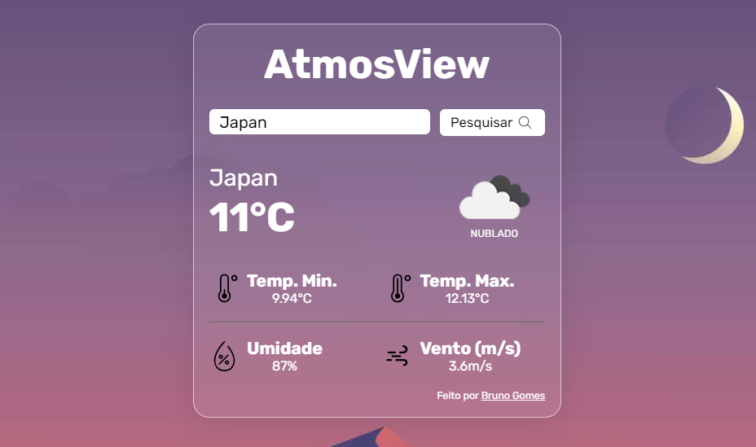

[JAVASCRIPT__BADGE]: https://img.shields.io/badge/Javascript-000?style=for-the-badge&logo=javascript
[TYPESCRIPT__BADGE]: https://img.shields.io/badge/typescript-D4FAFF?style=for-the-badge&logo=typescript
[REACT__BADGE]: https://img.shields.io/badge/React-005CFE?style=for-the-badge&logo=react
[SCSS__BADGE]: https://img.shields.io/badge/scss-F7F7F7?style=for-the-badge&logo=sass
[SC__BADGE]: https://img.shields.io/badge/StyledComponents-fff?style=for-the-badge&logo=styledcomponents
[HTML__BADGE]: https://img.shields.io/badge/HTML-fff?style=for-the-badge&logo=html5&logoColor=30A3DC
[CSS__BADGE]: https://img.shields.io/badge/CSS3-fff?style=for-the-badge&logo=css3&logoColor=E94D5F
[PROJECT__BADGE]: https://img.shields.io/badge/📱Visit_this_project-000?style=for-the-badge&logo=project
[PROJECT__URL]: https://atmosview-bsg.vercel.app/
[PORTFOLIO__BADGE]: https://img.shields.io/badge/🖼PORTFOLIO-fff?style=for-the-badge&logo=project
[PORTFOLIO__URL]: https://devbrunogomes.vercel.app/

<h1 align="center" style="font-weight: bold;">AtmosView ⛅</h1>

![HTML5][HTML__BADGE]
![CSS3][CSS__BADGE]
![javascript][JAVASCRIPT__BADGE]

    

<h2 id="started">🚀 Project</h2>

An application made to check the weather of any place in the world. It consumes an external API to fetch information about the location entered by the user, displaying it dynamically.

[![project][PROJECT__BADGE]][PROJECT__URL]

<h2 id="started">🛠 Tools used</h2>

For made this app, I consumed an API of weather conditions for give me the informations what I need to do the application. The SVGs Icons were picked at an external repository. 

<h2 id="colab">🤝 About Me</h2>

I am front-end developer student, and this application is included in my personal portfolio. If you liked this application and want view other own projects visit my Portfolio.

[![project][PORTFOLIO__BADGE]][PORTFOLIO__URL]

